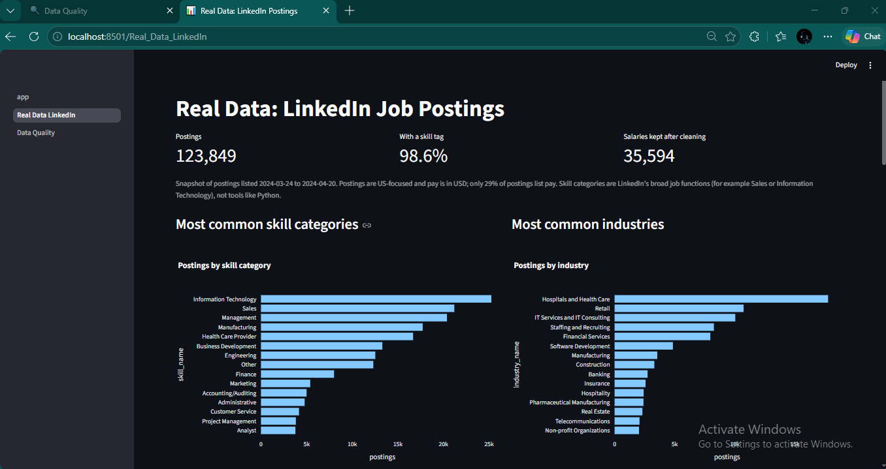
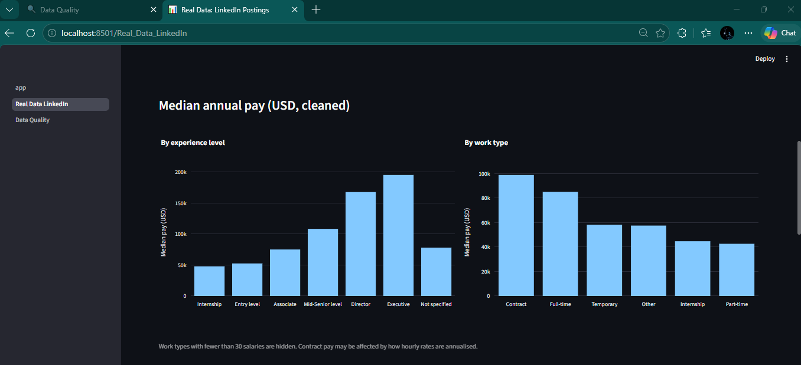
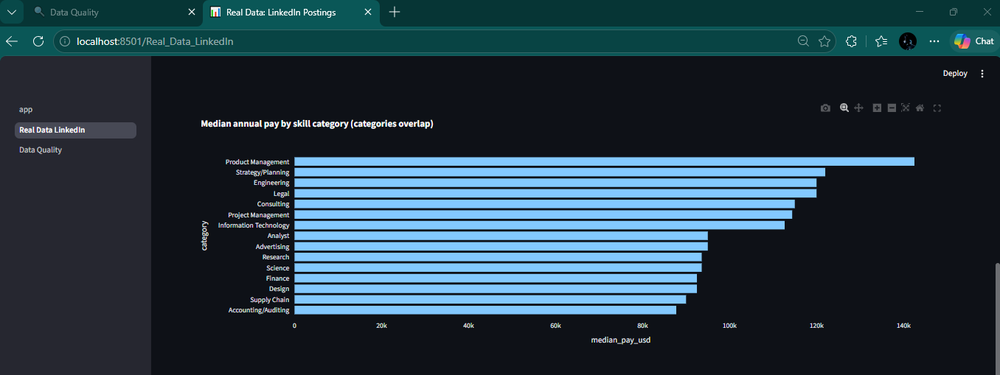
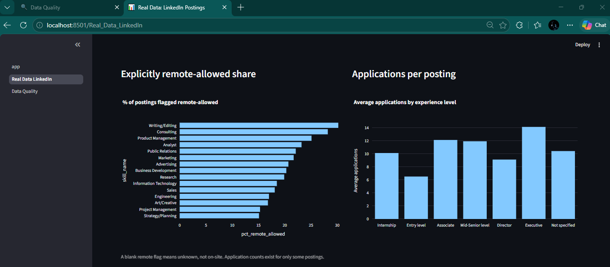
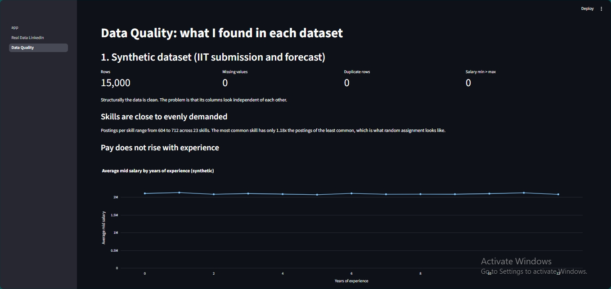
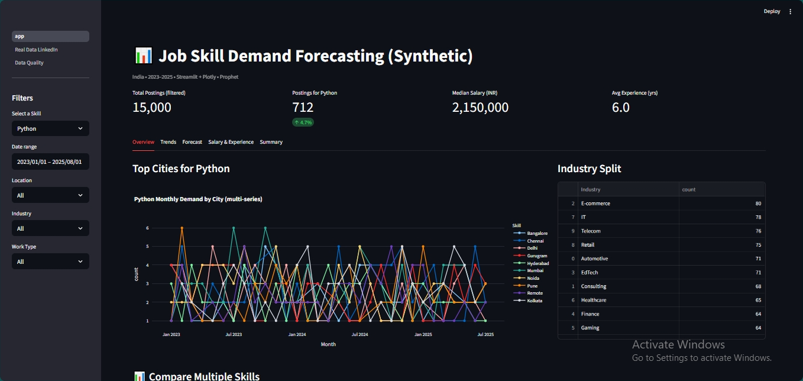

# Job Market Analytics & Skill Demand Forecasting

Final project for the **IIT Ropar AI Certification (NSDC and Masai)**, extended in v2.0 into a data analytics project with SQL and real job-posting data.

The project works with two datasets and keeps them separate on purpose:

| Dataset | Size | Used for |
|---|---|---|
| **Synthetic** job postings (India, 2023 to 2025) | 15,000 rows | The original IIT submission: pipeline, dashboard and Prophet forecasting |
| **LinkedIn job postings** (Kaggle, US-focused, Mar to Apr 2024) | 123,849 rows | Real-data analysis in SQL: skills, industries, pay, remote work |

I built the synthetic dataset because I could not find an open India-focused job-posting dataset with a usable monthly time series. While validating it in SQL I found it has no real signal (see [Data quality findings](#data-quality-findings)), so v2.0 adds real postings for the analysis and keeps the synthetic data for demonstrating the forecasting method.

## Versions

- **`v1.0-iit-submission`** (git tag): the project exactly as submitted for the certification. The submitted report and presentation are in `docs/`.
- **v2.0** (`main`): adds the MySQL layer, SQL analysis, real-data and data-quality dashboard pages, and fixes to the original app.

## Screenshots

**Real data page: overview**



**Median annual pay by experience level and work type**



**Median pay by skill category**



**Remote share and applications per posting**



**Data quality page**



**Forecast tab (synthetic data)**



## Key findings from the real data

Snapshot of 123,849 LinkedIn postings listed between 2024-03-24 and 2024-04-20. Pay figures use the 35,594 USD salaries that remain after cleaning.

- **Pay rises steeply with seniority.** Median annual pay: Internship $47,840, Entry level $52,500, Associate $74,994, Mid-Senior $108,180, Director $167,500, Executive $195,000. The overall median is $82,500.
- **Information Technology is the most common skill category** (20.4% of postings), followed by Sales (17.1%) and Management (16.5%).
- **Top industries by postings:** Hospitals and Health Care (17,762), Retail (10,731), IT Services and IT Consulting (10,039).
- **Analyst roles:** the Analyst skill category has a median annual pay of $95,000 across 1,243 postings with pay. It pairs most often with Research and Information Technology.
- **Remote work:** 12.3% of postings are explicitly flagged remote-allowed. The rest are blank, which means unknown and not on-site.
- **Competition:** entry-level postings average the fewest applications (6.5), while executive postings average the most (14.1), among postings that report an application count.

Skill categories are LinkedIn's broad job functions (for example Sales or Information Technology), not tools such as Python or SQL.

## Data quality findings

**Synthetic data.** Structurally clean (0 missing values, 0 duplicates, 0 salaries with min above max), but its columns behave as if assigned independently at random:

- Postings per skill range only from 604 to 712 across 23 skills.
- Average pay is flat across 0 to 12 years of experience, while real data shows a clear rise.
- Skills and job titles are paired at random (345 combinations averaging about 43 postings each, with unrealistic top pairs such as Deep Learning with Backend Developer).
- The trending-skill flag has no effect on applications (254.3 vs 256.0 on average).
- Monthly postings show no trend. The data ends on 2025-08-01, so August 2025 holds a single day.

This makes the synthetic data suitable for demonstrating the pipeline and forecasting method, but its patterns are not market findings.

**Real data cleaning rules.** All are judgment calls and are documented in `sql/14_salary_clean_view.sql`:

1. Use USD salaries only (36,058 of 36,073 salaries).
2. Postings labelled HOURLY with a maximum of $1,000 or more were treated as annual figures and use the midpoint of the stated range. 30 of the 38 salaries above $1M carried an HOURLY label.
3. Keep annual pay between $15,000 and $1,000,000. This leaves 35,594 salaries.
4. Skill and industry tags whose job ID is not in the postings file (4,711 and 4,712 IDs) are excluded through views. Of the postings, 98.6% have a skill tag and 98.8% have an industry tag.
5. Blank values are reported as "Not specified". A blank remote flag is not treated as on-site.

## Limitations

- The LinkedIn data is a four-week snapshot, so it supports descriptive analysis only and not forecasting. The Prophet forecast runs on the synthetic data.
- The LinkedIn data is US-focused and pay is in USD, so it does not describe the Indian market.
- Only 29% of postings list pay. Contract pay may be inflated where hourly rates were annualised.
- The pay cut-offs in the cleaning rules have not been validated against an outside source.
- Skill and pair counts overlap, because one posting can carry several skill categories.

## Dashboard

The Streamlit app has three pages in the sidebar:

- **app**: the original dashboard (overview, trends, forecast, salary and experience, summary) on the synthetic data.
- **Real Data LinkedIn**: the real-data results above.
- **Data Quality**: the checks that exposed the synthetic data's limits, and the cleaning rules for the real data.

The Real Data and Data Quality pages read small result files from `data/summaries/`, so the dashboard runs without MySQL.

## Tech

Python (pandas, numpy), Plotly, Streamlit, Prophet, MySQL, SQLAlchemy, PyMySQL, python-dotenv. NLTK is optional (`scripts/setup_nltk.py`).

## Project structure

```
job-skill-demand-forecasting/
├─ app.py                      # original dashboard (synthetic data)
├─ pages/
│  ├─ 1_Real_Data_LinkedIn.py  # real-data page
│  └─ 2_Data_Quality.py        # data quality page
├─ src/                        # loading, preprocessing, features, forecasting, charts
├─ sql/                        # schema, validation, cleaning and analysis queries
├─ scripts/
│  ├─ load_to_mysql.py         # loads the synthetic CSV into MySQL
│  ├─ load_linkedin_postings.py
│  ├─ load_linkedin_lookups.py
│  ├─ export_summaries.py      # exports result tables to data/summaries/
│  └─ setup_nltk.py
├─ data/
│  ├─ synthetic_job_postings_2023_2025.csv
│  ├─ summaries/               # small result tables used by the dashboard
│  └─ raw/                     # LinkedIn files (not in the repo, see below)
├─ docs/                       # submitted report and presentation (v1.0)
├─ assets/                     # screenshots
├─ requirements.txt
└─ README.md
```

## Workflow

```text
Synthetic CSV ──────────────► Streamlit app (EDA, Prophet forecast)

LinkedIn CSVs (Kaggle)
   ↓  chunked Python loaders
MySQL (job_market)
   ↓  SQL: validation, cleaning, views, medians
Summary CSVs (data/summaries)
   ↓
Streamlit pages (Real Data, Data Quality)
```

## SQL files

| File | Purpose |
|---|---|
| `01_schema.sql`, `02_validation.sql` | Synthetic table and load checks |
| `03_cleaning.sql`, `03b_checks.sql`, `03c_signal.sql` | Duplicates, categories, and whether salary, skill and experience are related |
| `06_linkedin_schema.sql`, `07_linkedin_validation.sql` | LinkedIn postings table and load checks |
| `08_linkedin_business_queries.sql` | Titles, locations, experience mix, remote share, applications |
| `09_salary_outlier_check.sql`, `11_salary_inspect.sql` | Finding the mislabelled pay periods |
| `10_linkedin_lookup_schema.sql` | Skill and industry tables |
| `12_linkedin_skills_industries.sql`, `13_linkedin_corrected.sql` | Skill and industry analysis, corrected for orphan job IDs |
| `14_salary_clean_view.sql` | Cleaned salary view and median pay by group |

## Data dictionary (key columns)

**Synthetic table (`job_postings`)**: `posting_date`, `skill`, `job_title`, `company`, `location`, `experience_required`, `industry`, `work_type`, `salary_min`, `salary_max` (INR per year), `education_level`, `employment_type`, `tech_stack`, `application_count`, `trending_skill_flag`, `sector_growth_index`.

**LinkedIn table (`linkedin_postings`)**: `job_id`, `title`, `company_name`, `location`, `formatted_work_type`, `formatted_experience_level`, `remote_allowed`, `pay_period`, `currency`, `min_salary`, `max_salary`, `normalized_salary`, `applies`, `views`, `listed_time`. The long description text is not loaded. Skills and industries come from `linkedin_job_skills` and `linkedin_job_industries`, joined to lookup tables.

## Quickstart (dashboard only)

```
python -m venv .venv
# Windows
.venv\Scripts\activate
# macOS/Linux
source .venv/bin/activate

pip install -r requirements.txt
streamlit run app.py
```

## Rebuild the database (optional)

1. Install MySQL and create a `.env` file in the project root (it is git-ignored):
   ```
   DB_HOST=localhost
   DB_USER=root
   DB_PASSWORD=your_password
   DB_NAME=job_market
   ```
2. Run `sql/01_schema.sql`, then `python scripts/load_to_mysql.py` for the synthetic data.
3. Download the **LinkedIn Job Postings (2023 - 2024)** dataset from Kaggle and extract it into `data/raw/` so that `data/raw/postings.csv` exists. These files are about 500 MB and are not in the repo.
4. Run `sql/06_linkedin_schema.sql` and `sql/10_linkedin_lookup_schema.sql`, then:
   ```
   python scripts/load_linkedin_postings.py
   python scripts/load_linkedin_lookups.py
   ```
5. Run `sql/13_linkedin_corrected.sql` and `sql/14_salary_clean_view.sql` to create the views, then regenerate the dashboard tables with `python scripts/export_summaries.py`.

## Author

Nishant Kaushik
